# 🚀 E-FDT Platform - Environmental & Financial Digital Twin

<div align="center">


**Making Sustainable Infrastructure Transparent, Verifiable, and Unstoppable**

[🌐 Live Demo](https://soledft.vercel.app/) | [📖 Documentation](https://github.com/Pooja-Bendre/soledft/edit/main/README.md) | [🔗 Solana Explorer](https://explorer.solana.com/?cluster=devnet) | [💻 GitHub](https://github.com/Pooja-Bendre/soledft.git)

</div>

---

## 📋 Table of Contents
- [Overview](#-overview)
- [The Problem](#-the-problem)
- [Our Solution](#-our-solution)
- [Architecture](#-architecture)
- [Features](#-features)
- [Solana Integration](#-solana-integration)
- [Tech Stack](#-tech-stack)
- [Installation](#-installation)
- [Usage](#-usage)
- [Team](#-team)
- [Hackathon Submission](#-hackathon-submission)

---

## 🎯 Overview

**E-FDT (Environmental & Financial Digital Twin)** is a revolutionary blockchain-powered platform built for **DevNova Hackathon 2026** that transforms sustainable infrastructure analysis from a 6-12 month opaque process into a **5-second transparent, blockchain-verified system**.

### 🏆 DevNova Hackathon 2026 - Solana Track

We're competing in the **Solana Blockchain Track** with a novel use case that brings government infrastructure transparency to Web3.

### ⚡ Key Highlights

```
Traditional Analysis  →  E-FDT Platform
─────────────────────    ─────────────────
⏰ 6-12 months       →   ⚡ 5 seconds
💰 ₹50 Lakh cost     →   💸 ₹0.00001 SOL
🔒 Zero transparency →   🔍 100% verifiable
❌ Can't audit       →   ✅ Permanent blockchain proof
```

---

## 🚨 The Problem

### Traditional Sustainable Infrastructure Analysis is Broken:

| Issue | Impact |
|-------|--------|
| **⏰ Time-Consuming** | 6-12 months per project analysis |
| **💰 Expensive** | ₹50 Lakh+ per comprehensive analysis |
| **🔒 Opaque** | Zero transparency in decision-making |
| **❌ Unverifiable** | No way to audit compliance claims |
| **🤷 Inaccessible** | Citizens can't verify government decisions |
| **😰 No Trust** | Investors can't independently verify ESG claims |

### 📊 Market Context
- **$12 Trillion** global infrastructure market
- **India's Net Zero 2070** target requires transparent tracking
- **Thousands** of infrastructure projects need analysis annually
- **Millions** of citizens demand accountability

---

## 💡 Our Solution

### **We do it in 5 SECONDS. On the BLOCKCHAIN. For EVERYONE to see.**

E-FDT combines:
1. **⚡ AI-Powered Analysis** - Lightning-fast comprehensive evaluation
2. **🔗 Solana Blockchain** - Permanent, verifiable records
3. **💼 Investment Marketplace** - Three-way transparency platform

### 🎮 How It Works (Simple Flow)

```mermaid
graph LR
    A[👤 User] -->|1. Select City| B[🤖 AI Analysis]
    B -->|2. Process 15+ Metrics| C[📊 Generate Results]
    C -->|3. Create Transaction| D[⛓️ Solana Blockchain]
    D -->|4. Confirm & Store| E[✅ Permanent Record]
    E -->|5. Generate Link| F[🔍 Solana Explorer]
    F -->|6. Anyone Can Verify| G[👥 Public Verification]
```



---

## 🏗️ Architecture

### **System Architecture Diagram**

```
┌─────────────────────────────────────────────────────────────────┐
│                        USER INTERFACE LAYER                      │
│  ┌──────────────┐  ┌──────────────┐  ┌────────────────────┐   │
│  │  🏛️ Government │  │  💼 Investors │  │  👥 Public Audit   │   │
│  │    Portal     │  │   Dashboard   │  │       View         │   │
│  └──────────────┘  └──────────────┘  └────────────────────┘   │
│                                                                  │
│                   ┌─────────────────────┐                       │
│                   │  👛 Phantom Wallet   │                       │
│                   │    Integration       │                       │
│                   └─────────────────────┘                       │
└───────────────────────────┬─────────────────────────────────────┘
                            │
                            ▼
┌─────────────────────────────────────────────────────────────────┐
│                    APPLICATION LOGIC LAYER                       │
│                                                                  │
│  ┌──────────────────────────────────────────────────────────┐  │
│  │              🤖 AI ANALYSIS ENGINE                        │  │
│  │  ┌────────────────────────────────────────────────────┐  │  │
│  │  │ • Geospatial Data Processing (20 Indian Cities)    │  │  │
│  │  │ • Carbon Credit Calculations (Gold Standard)       │  │  │
│  │  │ • Compliance Checking (LEED, Green Building)       │  │  │
│  │  │ • Climate Resilience Modeling (IPCC Scenarios)     │  │  │
│  │  │ • Social Impact Assessment (UN SDG Alignment)      │  │  │
│  │  │ • Economic Viability Analysis (ROI, Jobs)          │  │  │
│  │  └────────────────────────────────────────────────────┘  │  │
│  └──────────────────────────────────────────────────────────┘  │
│                                                                  │
│  ┌──────────────────────────────────────────────────────────┐  │
│  │          🔗 BLOCKCHAIN INTEGRATION MODULE                 │  │
│  │  ┌────────────────────────────────────────────────────┐  │  │
│  │  │ • Transaction Creation (Solana Web3.js)            │  │  │
│  │  │ • Wallet Signature Handling                        │  │  │
│  │  │ • Memo Program Data Encoding                       │  │  │
│  │  │ • Confirmation & Finality Checking                 │  │  │
│  │  │ • Explorer Link Generation                         │  │  │
│  │  └────────────────────────────────────────────────────┘  │  │
│  └──────────────────────────────────────────────────────────┘  │
│                                                                  │
│  ┌──────────────────────────────────────────────────────────┐  │
│  │           💼 INVESTMENT MARKETPLACE                       │  │
│  │  ┌────────────────────────────────────────────────────┐  │  │
│  │  │ • Project Browser & Filtering                      │  │  │
│  │  │ • Funding Progress Tracker                         │  │  │
│  │  │ • On-Chain Investment Recording                    │  │  │
│  │  │ • Government Approval Verification                 │  │  │
│  │  │ • Carbon Credit Portfolio Management               │  │  │
│  │  └────────────────────────────────────────────────────┘  │  │
│  └──────────────────────────────────────────────────────────┘  │
└───────────────────────────┬─────────────────────────────────────┘
                            │
                            ▼
┌─────────────────────────────────────────────────────────────────┐
│                  ⛓️  SOLANA BLOCKCHAIN LAYER (DEVNET)           │
│                                                                  │
│  ┌──────────────────────────────────────────────────────────┐  │
│  │                  📝 TRANSACTION RECORDS                   │  │
│  │  • 87-Character Signatures (Real, Verifiable)            │  │
│  │  • Block Confirmations (Sub-Second Finality)             │  │
│  │  • Timestamps (Permanent, Immutable)                     │  │
│  └──────────────────────────────────────────────────────────┘  │
│                                                                  │
│  ┌──────────────────────────────────────────────────────────┐  │
│  │              💾 MEMO PROGRAM DATA STORAGE                 │  │
│  │  Program ID: MemoSq4gqABAXKb96qnH8TysNcWxMyWCqXgDLGmfcHr │  │
│  │                                                            │  │
│  │  Stored Data Structure:                                   │  │
│  │  {                                                         │  │
│  │    "platform": "E-FDT",                                   │  │
│  │    "action": "CARBON_CREDITS_VERIFIED",                   │  │
│  │    "city": "Mumbai",                                      │  │
│  │    "credits": 7703,                                       │  │
│  │    "value_inr": 959023,                                   │  │
│  │    "compliance": "Grade A",                               │  │
│  │    "timestamp": "2026-01-04T03:55:03.767Z"               │  │
│  │  }                                                         │  │
│  └──────────────────────────────────────────────────────────┘  │
│                                                                  │
│  ┌──────────────────────────────────────────────────────────┐  │
│  │              🔍 PUBLIC VERIFICATION LAYER                 │  │
│  │  • Solana Explorer Integration                            │  │
│  │  • Direct Transaction Links                               │  │
│  │  • Real-Time Status Checking                              │  │
│  │  • Immutable Audit Trail                                  │  │
│  └──────────────────────────────────────────────────────────┘  │
└─────────────────────────────────────────────────────────────────┘

                            ▼
                            
┌─────────────────────────────────────────────────────────────────┐
│                    🌐 EXTERNAL INTEGRATIONS                      │
│                                                                  │
│  ┌──────────────┐  ┌──────────────┐  ┌──────────────────────┐ │
│  │   Solana     │  │   Phantom    │  │   Solana Explorer    │ │
│  │   Devnet     │  │   Wallet     │  │   (Verification)     │ │
│  │    RPC       │  │    API       │  │                      │ │
│  └──────────────┘  └──────────────┘  └──────────────────────┘ │
└─────────────────────────────────────────────────────────────────┘
```

### **Data Flow Diagram**

```
User Action (Analysis Request)
         │
         ▼
┌─────────────────────┐
│  AI Processing      │
│  (5 seconds)        │
│  • Carbon calc      │
│  • Compliance check │
│  • Impact analysis  │
└─────────┬───────────┘
          │
          ▼
┌─────────────────────┐
│  Create Transaction │
│  • Add transfer     │
│  • Add memo data    │
│  • Set fee payer    │
└─────────┬───────────┘
          │
          ▼
┌─────────────────────┐
│  Wallet Signs       │
│  • User approves    │
│  • Phantom signs    │
└─────────┬───────────┘
          │
          ▼
┌─────────────────────┐
│  Send to Blockchain │
│  • Submit to Solana │
│  • Wait for confirm │
└─────────┬───────────┘
          │
          ▼
┌─────────────────────┐
│  Permanent Record   │
│  • 87-char signature│
│  • Stored forever   │
│  • Anyone can verify│
└─────────────────────┘
```

---

## 🌟 Features

### **1. ⚡ Lightning-Fast AI Analysis**

Analyzes **15+ critical metrics** in **5 seconds**:

- 🌱 **Carbon Credits** - Gold Standard verified methodology
- ✅ **Compliance Scores** - LEED India, Green Building Council, Net Zero 2070
- 🌡️ **Climate Resilience** - IPCC scenario modeling
- 👥 **Social Impact** - UN SDG alignment, environmental justice
- 💼 **Economic Viability** - ROI calculations, job creation estimates
- 🏗️ **Site Analysis** - Geospatial data for 20 Indian cities

**Cities Covered:**
```
Mumbai | Delhi | Bangalore | Chennai | Hyderabad | Kolkata
Pune | Ahmedabad | Jaipur | Lucknow | Kochi | Chandigarh
Indore | Bhopal | Patna | Nagpur | Surat | Vadodara
Coimbatore | Visakhapatnam
```

### **2. 🔗 Real Solana Blockchain Integration**

**Not simulated. REAL blockchain transactions.**

```javascript
// Every analysis creates this:
Transaction Signature: "2TvCpE9MS2bVSzLq1s5txj9vgquno7FQig..."
Block: #123456789
Status: ✅ Confirmed
Network: Devnet
Cost: 0.000001 SOL
Verifiable: https://explorer.solana.com/tx/[signature]?cluster=devnet
```

**What's Stored On-Chain:**
```json
{
  "platform": "E-FDT",
  "action": "CARBON_CREDITS_VERIFIED",
  "city": "Mumbai",
  "credits": 7703,
  "value_inr": 959023,
  "compliance_grade": "A",
  "government_approved": true,
  "timestamp": "2026-01-04T03:55:03.767Z"
}
```

### **3. 💼 Investment Marketplace**

**Three-Way Transparency Platform:**

#### 🏛️ **For Governments:**
- Create and approve sustainable projects
- Set funding targets and timelines
- Track investment progress in real-time
- Every decision recorded on blockchain
- Complete accountability

#### 💼 **For Investors:**
- Browse 20+ verified infrastructure projects
- Filter by:
  - Government approval status
  - City location
  - Funding progress
  - Carbon credit potential
- See detailed metrics:
  - Expected ROI
  - Jobs created
  - Compliance grades
  - Carbon credits
- **Invest with one click** via Phantom wallet
- Get blockchain proof instantly

#### 👥 **For Citizens/Public:**
- View all government projects
- Verify investment flows
- Check compliance claims
- Audit carbon credit calculations
- Hold everyone accountable
- All data verifiable on Solana Explorer

### **4. 📊 Comprehensive Dashboard**

Interactive visualizations:
- 🗺️ **Site Map** - Leaflet integration showing project locations
- 📈 **Carbon Credits Chart** - Gold Standard verification
- ✅ **Compliance Radar** - Multi-criteria assessment
- 🌡️ **Climate Risk Matrix** - IPCC scenario analysis
- 💰 **Financial Overview** - ROI, costs, revenue projections
- 👥 **Social Impact** - Jobs, communities, SDG alignment

---

## ⚡ Solana Integration

### **Why We Chose Solana**

| Feature | Ethereum | Solana | Why It Matters for E-FDT |
|---------|----------|--------|--------------------------|
| **Transaction Speed** | 1-2 minutes | **0.4 seconds** | Government needs instant verification ⚡ |
| **Transaction Cost** | $2-50 | **$0.00001** | Can record thousands of projects affordably 💰 |
| **Throughput (TPS)** | 15-30 | **65,000** | Scale to all of India without congestion 📈 |
| **Finality** | 6 minutes | **0.4 seconds** | Real-time compliance checking ✅ |
| **Energy Efficient** | High | **Ultra-low** | Aligns with sustainability mission 🌱 |

### **How We Use Solana**

#### **1. Wallet Integration**
```javascript
// Connect Phantom Wallet
const provider = window.solana;
const response = await provider.connect();
const publicKey = response.publicKey.toString();
```

#### **2. Transaction Creation**
```javascript
// Create transaction with memo data
const transaction = new Transaction().add(
    SystemProgram.transfer({
        fromPubkey: wallet.publicKey,
        toPubkey: wallet.publicKey,
        lamports: 5000
    })
);

// Add memo with analysis data
const memoData = JSON.stringify({
    platform: 'E-FDT',
    action: 'CARBON_VERIFIED',
    city: 'Mumbai',
    credits: 7703,
    value: 959023
});

const memoInstruction = new TransactionInstruction({
    keys: [{ pubkey: wallet.publicKey, isSigner: true, isWritable: true }],
    programId: new PublicKey('MemoSq4gqABAXKb96qnH8TysNcWxMyWCqXgDLGmfcHr'),
    data: new TextEncoder().encode(memoData)
});

transaction.add(memoInstruction);
```

#### **3. Sign & Send**
```javascript
// User signs via Phantom
const signed = await provider.signTransaction(transaction);

// Send to Solana
const signature = await connection.sendRawTransaction(signed.serialize());

// Confirm
await connection.confirmTransaction(signature, 'confirmed');
```

#### **4. Public Verification**
```javascript
// Generate Explorer link
const explorerUrl = `https://explorer.solana.com/tx/${signature}?cluster=devnet`;

// Anyone can verify by pasting signature
```

### **Solana Features We Leverage**

- ✅ **Memo Program** - Store JSON data on-chain
- ✅ **Devnet** - Free testing for government pilots
- ✅ **Sub-second Finality** - Real-time verification
- ✅ **Low Cost** - Affordable at scale
- ✅ **Web3.js** - Clean JavaScript integration
- ✅ **Phantom Wallet** - User-friendly authentication

---

## 🛠️ Tech Stack

### **Frontend**
```javascript
HTML5, CSS3, JavaScript (ES6+)
Leaflet.js        // Interactive maps
Chart.js          // Data visualizations
Font Awesome      // Icons
```

### **Blockchain**
```javascript
Solana Web3.js v1.87+     // Blockchain integration
Phantom Wallet            // User authentication
Memo Program              // On-chain data storage
Solana Devnet            // Testing environment
```

### **Deployment**
```
Vercel                    // Frontend hosting
GitHub                    // Version control
```

---

## 📦 Installation

### **Prerequisites**
- Node.js (v16+)
- Phantom Wallet Extension
- Git

### **Clone Repository**
```bash
git clone https://github.com/Pooja-Bendre/soledft.git
cd soledft
```

### **Install Dependencies**
```bash
# Install Solana Web3.js (if building locally)
npm install @solana/web3.js
```

### **Run Locally**
```bash
# Open with live server or
python -m http.server 8000
# Navigate to http://localhost:8000
```

### **Deploy to Vercel**
```bash
# Install Vercel CLI
npm install -g vercel

# Deploy
vercel --prod
```

---

## 🎮 Usage

### **For Governments**

1. **Connect Wallet**
   ```
   Click "Connect Wallet" → Approve in Phantom
   ```

2. **Select City**
   ```
   Choose from 20 Indian cities
   ```

3. **Run Analysis**
   ```
   Click "Analyze" → AI processes in 5 seconds
   ```

4. **View Results**
   ```
   See carbon credits, compliance, social impact
   ```

5. **Blockchain Verification**
   ```
   Get transaction signature → Share with citizens
   ```

### **For Investors**

1. **Browse Marketplace**
   ```
   Visit /invest.html → See all projects
   ```

2. **Filter Projects**
   ```
   By status: Government Approved / Pending / Funded
   By city: Mumbai / Delhi / Bangalore...
   ```

3. **Review Details**
   ```
   Carbon credits, ROI, compliance grade, jobs created
   ```

4. **Invest**
   ```
   Click "Invest Now" → Enter amount → Confirm with wallet
   ```

5. **Get Proof**
   ```
   Receive 87-character signature → View on Solana Explorer
   ```

### **For Citizens**

1. **Verify Government Claims**
   ```
   Get transaction signature from government
   ```

2. **Check on Explorer**
   ```
   Go to explorer.solana.com/?cluster=devnet
   Paste signature → See all data
   ```

3. **Audit Investments**
   ```
   Browse marketplace → See funding progress
   Verify blockchain records
   ```

---

## 📊 Key Metrics

### **Platform Statistics**
- ✅ **20** Indian cities covered
- ⚡ **5 seconds** analysis time
- 🌱 **7,703 tons** CO2 verified (Mumbai demo)
- 💰 **₹9.59 Lakh** carbon credit value (Mumbai)
- 🎯 **100%** compliance grade possible
- 💸 **0.000001 SOL** per transaction cost
- ⏱️ **0.4 seconds** blockchain finality

### **Technical Achievement**
- ✅ Full Solana Web3.js integration
- ✅ Real Devnet transactions
- ✅ Phantom wallet authentication
- ✅ Memo program data storage
- ✅ Explorer verification links
- ✅ Investment marketplace live
- ✅ 87-character real signatures

---

## 👥 Team

### **Team E-FDT**

**👨‍💼 Team Leader:**
- **Pooja Sunil Bendre**
  - Full-stack developer
  - Blockchain integration specialist
  - UI/UX designer

**👨‍💻 Team Member:**
- **Gangi Reddy Gari Venkata Indra Reddy**
  - Backend developer
  - Data analytics
  - API integration

---

## 🏆 Hackathon Submission

### **DevNova Hackathon 2026**

**Track:** Solana Blockchain Innovation

**Category:** Real-World Blockchain Applications

### **What Makes Our Submission Special**

#### **1. Real Blockchain Integration** ✅
- Not simulated or mocked
- Actual Solana Devnet transactions
- 87-character verifiable signatures
- Public verification on Solana Explorer

#### **2. Novel Use Case** 🎯
- First government infrastructure platform on Solana
- Bridges Web2 (government data) with Web3 (blockchain)
- Beyond DeFi/NFTs - solving $12 trillion problem
- Direct application to India's Net Zero 2070 goals

#### **3. Production Ready** 🚀
- Works RIGHT NOW at https://soledft.vercel.app/
- 20 cities with real geospatial data
- Functional investment marketplace
- Professional UI/UX
- Complete error handling

#### **4. Solana-Specific Advantages** ⚡
- **Speed:** Sub-second finality enables real-time verification
- **Cost:** Makes micro-compliance transactions viable
- **Scalability:** Can handle thousands of projects simultaneously
- **Devnet:** Free testing for governments before mainnet

#### **5. Open Source Contribution** 📖
- Clean, documented code
- Reusable Solana integration patterns
- Educational value for other builders
- Available on GitHub

### **Judge Verification Steps**

**30-Second Verification Process:**

1. **Visit Platform**
   ```
   https://soledft.vercel.app/
   ```

2. **Connect Phantom Wallet**
   ```
   Click "Connect Wallet" → Approve
   ```

3. **Run Analysis**
   ```
   Select "Mumbai" → Click "Analyze"
   ```

4. **Get Signature**
   ```
   Copy 87-character transaction signature
   ```

5. **Verify on Explorer**
   ```
   https://explorer.solana.com/?cluster=devnet
   Paste signature → See our data on-chain!
   ```

**Example Signature:**
```
2TvCpE9MS2bVSzLq1s5txj9vgquno7FQig9gnvsqRTswh7RvCeMCUX9MZbJUuByAjCJPuWp2RERgqosvfe1dTnPb
```

---

## 🎯 Impact & Vision

### **Real-World Impact**

#### **Government Transformation**
```
Before E-FDT:
⏰ 6-12 months analysis
💰 ₹50 Lakh cost
🔒 Zero transparency
❌ Citizens can't verify

After E-FDT:
⚡ 5 seconds analysis
💸 ₹0.00001 SOL cost
🔍 100% transparent
✅ Anyone can verify on blockchain
```

#### **Investor Confidence**
```
Before E-FDT:
😰 Can't verify ESG claims
❓ No carbon credit tracking
📊 Opaque reporting
💼 High audit costs

After E-FDT:
✅ Blockchain-verified compliance
🌱 On-chain carbon credits
📈 Real-time transparency
💰 Near-zero verification cost
```

#### **Citizen Empowerment**
```
Before E-FDT:
🤷 "Just trust the government"
❌ No way to verify claims
🔒 Decisions behind closed doors

After E-FDT:
🔍 Verify every government decision
✅ Check blockchain records
👥 Hold authorities accountable
🌐 Public audit trail forever
```

### **Future Roadmap**

#### **Phase 1: Mainnet Launch** (Q2 2026)
- Deploy on Solana Mainnet
- Partner with 5 pilot cities
- Tokenize carbon credits as SPL tokens

#### **Phase 2: Scale** (Q3 2026)
- Expand to 100+ Indian cities
- Government partnership program
- Investor onboarding campaign

#### **Phase 3: International** (Q4 2026)
- Launch in Southeast Asia
- UN SDG partnership
- Global carbon credit marketplace

---
---

## 📄 License

This project is open source and available under the [MIT License](LICENSE).

---

## 🤝 Contributing

We welcome contributions! Please see our [Contributing Guidelines](CONTRIBUTING.md).

---

## 🔗 Links

- **🌐 Live Platform:** https://soledft.vercel.app/
- **💼 Investment Marketplace:** https://soledft.vercel.app/invest.html
- **💻 GitHub Repository:** https://github.com/Pooja-Bendre/soledft.git
- **🔍 Solana Explorer:** https://explorer.solana.com/?cluster=devnet
- **👛 Get Phantom Wallet:** https://phantom.app/

---

## 📧 Contact

**Team E-FDT**

- **Email:** pbendre542@gmail.com

---

## 🙏 Acknowledgments

- **DevNova Hackathon 2026** - For the opportunity to showcase our solution
- **Solana Foundation** - For the incredible blockchain technology
- **Phantom Wallet** - For seamless Web3 integration
- **Open Source Community** - For the amazing tools and libraries

---

<div align="center">

## 🚀 **Ready to Transform Sustainable Infrastructure?**

### [🌐 Try E-FDT Live](https://soledft.vercel.app/) | [📖 Read Docs](#) | [⭐ Star on GitHub](https://github.com/Pooja-Bendre/soledft.git)

**Built with ❤️ for DevNova Hackathon 2026**

**Powered by Solana Blockchain ⚡**

---


**Making Every Infrastructure Decision Transparent, Verifiable, and Unstoppable** 🌍

</div>
